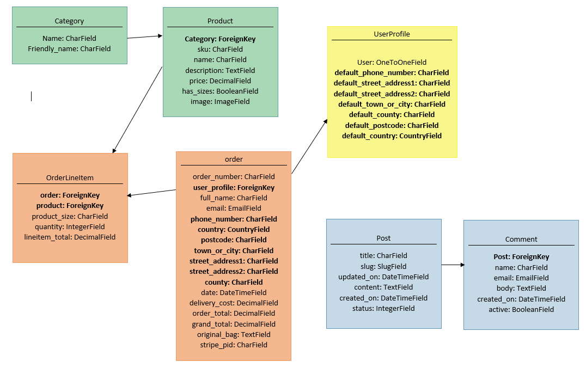

# Ladeez Golf Website


[View live project here](https://edavies2020-ladeez-golf.herokuapp.com/)

This website has been created for my full stack milestone project. 

The site created is a fictional e-commerce womens golf shop buisness, I chose this as a female golfer myself. Customers can browe products and purchase if they choose to do so. They can set up an account and follow female golf news.


# Table of Contents <a name="home"></a>


1. [Introduction](#Introduction)
2. [User Experience (UX)](#UX)
3. [Design](#Design)
5. [Features](#Features)
6. [Technologies Used](#Technologies)
7. [Testing](#Testing)
8. [Database Design](#Database)
8. [Deployment](#Deployment)
9. [Cloning Repository](#Cloning)
10. [Credits](#Credits)


# Introduction <a name="introduction"></a>


## Website Purpose :

* This website is for customers interested in buying womens golf products
* Customers want to be able to browse through products and make a purchase
* The simple, intuative layout of the site allows users to easily add items to their bag and make purchases


[ Back to Table of Contents](#home)


# User Experience (UX) <a name="UX"></a>


## As a Developer:

* As the developer, I want to create a website for the business owner to show their products
* As the developer, I want the website to be aesthetically pleasing by making good use of HTML, CSS and Javascript 
* As the developer, I want the website to function in the intended ways and allowing purchasing of items, setting an account and leaving comments

## As a Site Owner:

* As a site owner, I want to be able to add/edit and delete products on the site
* As a site owner, I want to be able to upload/edit news stories, and be able to delete news posts and approve comments

## As a Site User:

* As a user, I want to easily browse through all products for sale
* As a user, I want to view a specific category of products
* As a user, I want to search for a product using key words
* As a user, I want to view details of each product and see a clear image of the product
* As a user, I want to be able to choose the size of the product I want
* As a user, I want to be able to add product/s to my shopping bag
* As a user, I want to be able to purchase items in my shopping bag
* As a user, I want to create and sign in to my account
* As a user, I want to read news relating to ladies golf
* As a signed in user, I want to be able to save and update my delivery details
* As a signed in user, I want to be able to comment golf news


[ Back to Table of Contents](#home)


# Design <a name="Design"></a>


## Colours:

* I used Black, white and grey to keep the site simple and clear to all
* I used rgb(184, 33, 91) which is a dark pink/red as a nod to the site being aimed at women
* I used Recursive font as it is clear to read and modern 

## Images:

* All non-recipe images were chosen because they were relevant to womens golf 
* Non-product Images were sourced from [unspalsh](https://unsplash.com/) and [pixabay](https://pixabay.com/)
* Product images were sourced from [American Golf](https://www.americangolf.co.uk) and [Golf Online](https://www.golfonline.co.uk)
* News images & stoies came from google searches for womens golf news
 

## Favicon: 
* I used [Jimdo](https://www.jimdo.com/) to create my company logo and then used [favicon.io](https://favicon.io/) to convert my logo into a favicon


[ Back to Table of Contents](#home)


# Features <a name="Features"></a>


## Navbar/Footer

* The navbar is fixed on all pages and came from Bootstrap 
* The navbar features the company logo to the left 
* The navbar switches to a sidebar on smaller screens 
* Certain links are only visible for registered users
* The navbar and footer share the same colour scheme
* The footer has links to social media.<br><b>Note:</b> these links are for the pages main sites as this is a fabricated company


## Homepage

* There is a fixed image on the homepage with a 'Shop Now' Button which takes the user to all products
* There is a search bar for searching all products
* There are buttons for searching by category/price and viewing News articles
* There is a My account button which for non registered directs the user to sign up and for registered users directs to their order history and account details which can be updated
* There is a bag icon which takes the user to their shopping bag


## Products Page/s

* Easily accesible by selecting the 'Products' or another option from the navbar
* All Products page shows the user all items available
* Each product is displayed in a card showing an image of the product, the product name, and the price and its category type
* The product image being clicked will reveal more product details


## Product Details Pages

* There are Individual pages for each product to show more details
* This includes the product name, product image, price of product, product size selection (where relevant) and product description
* The user has the option of selecting the quantity they would like to purchase
* The user then has the option to add this quantity of the item to their bag or return to shopping


## Shopping Bag

* Accessed by selecting the bag icon from the navbar
* The user can view items aded to their bag and the total of the goods added
* The user has the option of updating the quantity, or removing the item from their bag
* Two buttons at the bottom of the page allow the user to either 'Keep shopping' or move forward to the 'Checkout' page
* A message displays to show how much more the user needs to spend to qualify for free delivery


## Checkout

* The order summary includes a breakdown of the order including delivery price if applicable 
* The checkout form will pull through the users profile information if they are logged in, if they are registered
* The Form requires the users name, email address, shippping details and payment details to complete the purchase
* The user can either 'Adjust cart' if they need to make changes to their order before purchasing or 'Pay now' to complete the order


## Checkout Success

* A 'timer' will appear to let the user know the transaction is processing
* They will then be taken to a page to let them know their purchase has been successful
* This page contains the order information, including unique order number, delivery details and billing information
* There is a back to shop button at the end of this information


## Log in / register functionality

* A user who is not logged in will have the option to 'Login' or 'Register' from the Profile icon on the navbar
* Django allauth was used for account management
* If user selects to 'Register' they are taken to a registration page which asks for their email address, and prompts to create a username and password
* The user will recieve a email to verify their account
* If the user selects to login they will be asked to enter their username and password


## Account

* A logged in user can access their account page from the profuile icon in the navbar
* The Account page shows the users default information and the users order history
* The default information can be updated by the user
* The order history shows a bteakdown of all orders with basic information showing
* In The order history column the user can click the order number which takes the user to the order confirmation for that order


## Toasts
* Bootstrap toasts were used to assure the user of their actions throughout their journey - Letting them know when an item was added/removed from their bag, if their order was succesfull, if they are logged in or logged out.
* Toasts were also used to show users what had been added to their bag and how much to get free delivery in a 'mini' shopping bag format


## Golf News
* Admin can update the news feed with new gold related stories
* Logged in users can comment on news posts
* Admin have the option of adding, editing and deleting news posts
* Logged in users have the option to add comments to news posts


## Admin / Superuser
* When a user is logged in as Admin/Superuser they will have different functionality to a regular user
* When they select the Profile icon from the navbar they will have the options to Add a News post, Add a Product
* If they select to add a product, they will be taken to a page to fill out a form and add a product
* If they select to add a news post, they will be taken to a page to fill out a form and add a news post 


[ Back to Table of Contents](#home)


# Technologies <a name="Technologies"></a>


1. Languages used: HTML5, CSS3, JQuery, Javascript,  Python and Jinja and Django framework was used to build the application

2. [GitHub](https://github.com/) 
    * My project code is stored in GitHub

3. [Git](https://gitpod.io/workspaces/) 
    * Git was used for version control, code created in GitPod was committed and pushed to GitHub

4. [unspalsh](https://unsplash.com/), [pixabay](https://pixabay.com/)
    * Used for images throughout the site

5. [Jimdo](https://www.jimdo.com/),
    * Used to create my company logos

6. [favicon.io](https://favicon.io/), 
    * Used to create my favicon
    
7. [FontAwesome](https://fontawesome.com/) 
    * Font Awesome icons were used throughout the site

8. [Bootstrap](https://getbootstrap.com/)
    * Used for product cards, forms, navbar, side nav, footer 

9. [Heroku](https://heroku.com/)
    * Used to deploy this repository

10. [Stripe](https://stripe.com/en-gb) 
    * Used for payments


[ Back to Table of Contents](#home)


# Testing <a name="Testing"></a>


Testing can be found here: [TESTING.md](TESTING.md)


[ Back to Table of Contents](#home)


# Database Design <a name="Database"></a>





[ Back to Table of Contents](#home)


# Deployment <a name="Deployment"></a>


- Create a Heroku account:
    - Go to https://signup.heroku.com/login and create an account/login to your account
    - From your dashboard click 'Create app'
    - Create a name for your app and select the region closest to you
    - Click 'Create app'

- Set up Postgres database on app:
    - Go to 'Resources' tab of Heroku app
    - Search for 'Postgres'
    - Add Postgres to the app, selecting to use the free development plan

- Back in your gitpod workspace install the following:

```
pip3 install dj_database_url
            
pip3 install psycopg2_binary
```       

- Freeze new requirements:
```
pip3 freeze > requirements.txt
```

- Go to settings.py file and import dj_database_url
```
import dj_database_url
```
    
- Add Postgres database settings to settings.py
```
DATABASES = {
    'default': dj_database_url.parse('ENTER DATABASE URL HERE')
    }
```

- Comment out settings for sqlite database
- Migrate Postgres database
``` 
python3 manage.py migrate
```

- Create a superuser:
```
python3 manage.py createsuperuser
```

- Add the following if statement to settings.py to use Postgres DB if available:
```
if 'DATABASE_URL' in os.environ:
    DATABASES = {
        'default': dj_database_url.parse(os.environ.get('DATABASE_URL'))
    }

else:
    DATABASES = {
        'default': {
            'ENGINE': 'django.db.backends.sqlite3',
            'NAME': BASE_DIR / 'db.sqlite3',
        }
    }
```
- To complete the Heroku set up install gunicorn and add to requirements.txt:
```
pip3 install Gunicorn
pip3 freeze > requirements.txt
```
- Create a Procfile file, and add the following:
```
web: gunicorn dulwich_interiors.wsgi:application
```

- Log into Heroku from your workspace termnial:
```
heroku login -i
```

- Next, disable static file
```
heroku config:set DISABLE_COLLECTSTATIC=1 --app <insert Heroku app name here>
```
        
- back to settings.py, add:
```
ALLOWED_HOSTS = ['edavies-ladeez-golf.herokuapp.com', 'localhost']
```
- git add and git commit changes to github
- git push changes to Heroku
```
git push heroku masin
```

- Back in Heroku, enable automatic deployment:
    - Go to setting tab of Heroku app
    - Click 'Connect to Github' and search the respository
    - Select the relevant repository
    - Click 'Enable automatic deploys'

## Setting up AWS to host static and media files:
- Go to https://aws.amazon.com/ and create an account
- Go to the AWS Management Console and search for 'S3'
- Access S3 and create a new bucket by selecting 'Create bucket'
- Name bucket and select nearest region
- Uncheck box that says 'Block all public access' and check the box to acknowledge that the bucket will be public
- When bucket is created, go to 'Properties' tab and turn on static website hosting, selecting the option to 'Use this bucket to host a website'
- Go to 'Permissions' tab and then 'CORS' configuration tab and add the following code:
``` [
  {
      "AllowedHeaders": [
          "Authorization"
      ],
      "AllowedMethods": [
          "GET"
      ],
      "AllowedOrigins": [
          "*"
      ],
      "ExposeHeaders": []
  }
]
```
- Go to 'Bucket Policy' tab and select 'Policy Generator' 
- On the Policy Generator page: select 'S3' Bucket as the Policy Type, set the 'Principal' input to '*' and the Action dropdown to 'GetObject'
- Back in the 'Bucket Policy' tab, copy the ARN and paste into ARN box on the AWS Policy Generator page
- Select to 'Generate Policy' and then copy the policy into the 'Bucket Policy' editor 
- Add a '/*' onto the end of the 'Resource' key and save changes
- Go to 'Access Control' tab and select 'Everyone' under the Public Acces heading 
- Set the 'List actions' box and save: Your Bucket is now set up
- Go back to AWS Services menu and search for IAM
- Select 'Groups' and then 'Create a new group' called 'manage-ladeez-golf'
- Create a policy by selecting 'Policies' from the navbar and then 'Create policy' 
- Go to JSON tab and select 'Import managed policy' then import the policy named 'S3 full access policy'
- Go back to bucket, copy the ARN and paste into 'Resource' key of JSON code
- Click 'Review policy', give the policy an appropriate name and a description and 'Create policy'
- Attach the policy to the group you just created: Click 'Attach policy' and attach the policy just created 
- Create a user for the group: Go to 'Users' page and 'Add user' 
- Create user called 'manage-ladeez-golf' and give them Programatic Access
- Add the user to the group just created
- Click 'Create User' and download the excel file that is created 
- Connect s3 to Django by installing two new packages back in your workspace terminal:
```
pip3 install boto3
pip3 install django-storages
```
- Freeze requirements.txt:
``` 
pip3 freeze > requirements.txt
```
- Go to installed apps in 'settings.py' file and add 'storages'
- In settings.py add:
```
if 'USE_AWS' in os.environ:
    AWS_STORAGE_BUCKET_NAME = 'edavies2020-ladeez-golf'
    AWS_S3_REGION_NAME = 'eu-west-2'
    AWS_ACCESS_KEY_ID = os.environ.get('AWS_ACCESS_KEY_ID')
    AWS_SECRET_ACCESS_KEY = os.environ.get('AWS_SECRET_ACCESS_KEY')
```
- Go to the settings tab of Heroku app and select 'Reveal config vars' and add the following:
    - AWS_ACCESS_KEY_ID: (Get value from excel file)
    - AWS_SECRET_ACCESS_KEY: (Get value from excel file)
    - USE_AWS: True
- Delete the 'DISABLE_COLLECTSTATIC' variable
- Go back to settings.py file and add:
```
AWS_S3_CUSTOM_DOMAIN = f'{AWS_STORAGE_BUCKET_NAME}.s3.amazonaws.com'
```
- Create a project level file named 'custom_storages.py' and add:
```
from django.conf import settings
from storages.backends.s3boto3 import S3Boto3Storage


class StaticStorage(S3Boto3Storage):
    location = settings.STATICFILES_LOCATION


class MediaStorage(S3Boto3Storage):
    location = settings.MEDIAFILES_LOCATION
```
- Go back to settings.py and add:
```
STATICFILES_STORAGE = 'custom_storages.StaticStorage'
STATICFILES_LOCATION = 'static'
DEFAULT_FILE_STORAGE = 'custom_storages.MediaStorage'
MEDIAFILES_LOCATION = 'media'

STATIC_URL = f'https://{AWS_S3_CUSTOM_DOMAIN}/{STATICFILES_LOCATION}/'
MEDIA_URL = f'https://{AWS_S3_CUSTOM_DOMAIN}/{MEDIAFILES_LOCATION}/'
```
- git add, git commit and git push changes
- Back to settings.py, and add:
```
AWS_S3_OBJECT_PARAMETERS = {
        'Expires': 'Thu, 31 Dec 2099 20:00:00 GMT',
        'CacheControl': 'max-age=94608000',
    }
```
- Go to s3 and create a folder called 'Media' 
- Upload all images used to this file 
- Ensure you select 'Grant public read access to these objects' before uploading


[ Back to Table of Contents](#home)


# Cloning <a name="Cloning"></a>


If you wish to clone a copy of my project you will need to:

- Navigate to my GitHub [repository](https://github.com/EDavies2020/LadeezGolf-MS4)

- Click the `Code` button next to the Green Gitpod button

- In your terminal type:

```
git clone (paste HTTPS link from above)
```

- Install the modules listed in the requirements.txt file using the following in the terminal:

```
python -m pip -r requirements.txt
```

- Install the JSON files using: 

```
python manage.py loaddata categories
```  
and: 
```
python manage.py loaddata products
``` 
- Make sure its in this order as "products" contains categories

- Create a SuperUser by using: 
```
python manage.py createsuperuser
``` 
- Follow the instructions to create a username and password

- Run migrations to create your database by using: 
```
python manage.py migrate
```

- Create a env.py file with the following information:

```
import os

os.environ ['AWS_ACCESS_KEY_ID'] = 'from Amazon AWS'
os.environ ['AWS_SECRET_ACCESS_KEY'] = 'from Amazon AWS'
os.environ ['DATABASE_URL'] = 'from Amazon AWS'
os.environ ['EMAIL_HOST_PASS'] = 'from email host(gmail)'
os.environ ['EMAIL_HOST_USER'] = 'from email host(gmail)'
os.environ ['SECRET_KEY'] = 'Secret key here'
os.environ ['STRIPE_PUBLIC_KEY'] = 'from Stripe'
os.environ ['STRIPE_SECRET_KEY'] = 'from Stipe'
os.environ ['STRIPE_WH_SECRET'] = 'from Stripe'
os.environ ['USE_AWS'] = 'True'
os.environ['DEVELOPMENT'] = 'True'

```
- The app can now be run locally by typing python manage.py runserver 


[ Back to Table of Contents](#home)


# Credits <a name="Credits"></a>


## Code

* Code Institute
    * Django Module, Boutique Ado Mini Project
    
* [Blog Tutrial](https://djangocentral.com/building-a-blog-application-with-django/)
    * News app was created using this tutorial

* [404 Tutorial](https://levelup.gitconnected.com/django-customize-404-error-page-72c6b6277317)
    * Tutorial for adding 404 page


## Media

* All images were sourced from the following sites: [unspalsh](https://unsplash.com/), [pixabay](https://pixabay.com/), [American Golf](https://www.americangolf.co.uk) and [Golf Online](https://www.golfonline.co.uk)
* News images & stoies came from google searches for womens golf news

## Acknowledgements

A big thank you to the following: 

* Tutor support for helping me with issues I had during the course/project
* My mentor Spencer for his feedback and support
* My wonderfully supportive family for being understanding when I am glued to my laptop for hours on end
* The Slack community for sharing problems you come across and helpful fixes offered
* The encouragement from other students Ive connected with during my time on the course, it is a great support network 


[ Back to Table of Contents](#home)