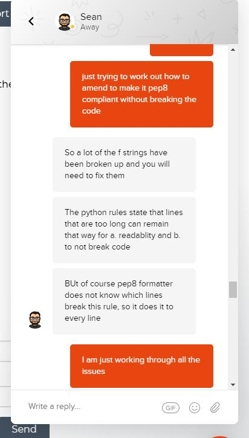

# Testing

# Table of Contents 
1. [Super User Details](#superuser)
2. [Validation Services](#validation)
3. [Errors/Warnings HTML](#html)
4. [Errors/Warnings CSS](#css)
5. [Errors/Warnings JS Hint](#js)
6. [Errors/Warnings PEP8](#pep8)
7. [Testing User Experience (UX)](#ux)
8. [Manual Testing](#manual)

# Super User Details 

Here are the superuser details for Ladeez Golf:

* username: emmad
* email: emmad@ladeezgolf.com
* password: CImilestone4

# Validation 

* [W3C Markup Validation Service](https://validator.w3.org/) - Used to validate html

* [W3C CSS Validation Service](https://jigsaw.w3.org/css-validator/) - Used to validate CSS

* [JS Hint](https://jshint.com/) - Used to validate JavaScript

* [PEP8 Online Service](http://pep8online.com/) - Used to validate CSS

[Back to Testing](TESTING.md)

# Errors/Warnings HTML 

* Stray </a> tags found - Resolved by removing stray tags

[Back to Testing](TESTING.md)

# Errors/Warnings CSS 

* number missing unit - Resolved by adding px to number
* pm not recognised - Resolved by changing typo to px
* solis not recognised - Resolved by changing typo to solid

[Back to Testing](TESTING.md)

# Errors/Warnings JS Hint 

* 2 missing semi colons added - Resolved by adding missing semi colons

# Errors/Warnings PEP8 

PEP8 showed a number of errors with length, white space and indentation. 

These have all been resolved by amending the length, removing white space amd correctly indenting code.

I had an issue after resolving PEP8 issues which meant that making lines shorter broke my webpage. 

I contacted tutor support and Sean helped me resolve the issue, this did mean some of my code isnt pep8 compliant in terms of length which I understand from Sean is okay according to python rules:

[Back to Testing](TESTING.md)

# Testing User Experience (UX) 

## As a Developer:

* As the developer, I want to create a website for the business owner to show their products 
    - All products are displayed clearly
* As the developer, I want the website to be aesthetically pleasing by making good use of HTML, CSS and Javascript 
    - The website has a consistant use of colours and styles with interative elements in appropriate places
* As the developer, I want the website to function in the intended ways and allowing purchasing of items, setting an account and leaving comments
    - The site has been manually tested and items can be purchased, you can create, amend and delet an account and users can leave comments on news stories

## As a Site Owner:

* As a site owner, I want to be able to add/edit and delete products on the site
    - The site has been manually tested and products can be added, edited and deleted correctly
* As a site owner, I want to be able to upload/edit news stories, and be able to delete news posts and approve comments
    - The site has been manually tested and New stories can be uploaded, amended and deleted. Comments can also be added and deleted.

## As a Site User:

* As a user, I want to easily browse through all products for sale
    - Products are easy to browse
* As a user, I want to view a specific category of products
    - Products can be viewed by category and sorted
* As a user, I want to search for a product using key words
    - There is a search bar at the top which will search for keywords in the website
* As a user, I want to view details of each product and see a clear image of the product
    - Each product has its own card which shows full details and a clearimage. The image can be clicked to show a larger version.
* As a user, I want to be able to choose the size of the product I want
    - There is an option to select a size
* As a user, I want to be able to add product/s to my shopping bag
    - Products can be added to the shopping bag and amended in the bag
* As a user, I want to be able to purchase items in my shopping bag
    - Users can checkout items in their shopping bag
* As a user, I want to create and sign in to my account
    - Users can create an account and sign in
* As a user, I want to read news relating to ladies golf
    - There is a news blog with stories on gold news 
* As a signed in user, I want to be able to save and update my delivery details
    - Users are able to save and update their delivery details in their account
* As a signed in user, I want to be able to comment golf news
    - Users can leave their comments on News stories

[Back to Testing](TESTING.md)

# Manual Testing 

# Navbar

* Clicking logo takes user back to homepage
* Search bar tested using words in single/multiple items titles and descriptions and ensure it is returned to the user
* User icon tested to ensure that it reveals the correct dropdown for a user is logged in / logged out / logged in as superuser
    * If user is not logged in the dropdown reveals 'Register' and 'Login'
    * If user is logged in the dropdown has two options 'My Profile' and 'Logout'
    * If superuser is logged in the dropdown has the following options: 'Product Management', 'News Management', 'My Profile' and 'Logout'
* Clicking the bag icon takes the user to the shopping bag
    * The user is advised if the shopping bag is empty
    * If there are items added to the bag they are displayed
* All dropdown items were tested to ensure the user is taken to the correct pages

# Footer

* The social media links all open correctly in a new tab
* As the site is fictional the user is taken to the generic social media site

# Homepage

* Shop Now button takes user to All Products Page

# Registering / logging in / logging out

* Registering
    * Clicking on the User icon above 'My Account' and selecting the Register option takes the user to the registration page
    * All form elements let the user know if they are completed incorrectly 
    * Submitting the form: an email is sent to the user with a link to follow to verify their email address
    * Clicking on the link: the user is brought back to the site and asked to 'Confirm' 
    * Clicking the 'Confirm' button the user is brought to the sign in page to sign in using the username and password just created

* Logging in
    * Clicking on the User icon above 'My Account' and selecting the Login option takes the user to the sign in page
    * The users are notified if they use an incorrect username/password
    * If correct username/password match the user is directed to the homepage and notified their log in was successful

* Logging out
    * Clicking on the User icon above 'My Account' and selecting the Logout option takes the user to the sign out page 
    * Clicking cancel takes the user to the homepage
    * Clicking sign out takes the user to the homepage and notifies them they have logged out

# Products Page

*Clicking on the product image takes the user to the product details page

# Product details page

* The user cannot change the quantity below 1 but can increase the quantity
* The keep shopping button takes the user back to the products page
* The add to bag button adds the product to the bag, a mini shopping bag appears top right
* Clicking on the product image opens the picture in a new tab

# Shopping Bag

* Clicking the bag icon when there are no items in the bag: 
    * The user is notified the bag is empty and the 'Keep shopping' button takes the user back to the products page
* Clicking the bag icon when there are items in the bag:
    * The user can change and update the quanity
    * The user can remove the item from the bag
* The secure checkout button takes the user to the checout page

# Checkout

* The user needs to complete the shipping details - the user is prompted to complete any fields left empty
* If the user leaves the card details blank the user is advised the card details are incomplete
* The adjust bag takes the user back to the shopping bag
* When all details are correct, the checkout button is clicked and a timer is displayed to show the user payment is being processed
* The user is directed to an order confirmation page which displays all the order details 
* The back to shop button directs the user back to the products page

# Profile Page

* The user change their address details and the update button saves the changes
* The users order history summary is displayed and clicking on the order number takes the user to the full order details
* In the full order page the back to profile button takes the user back to the users profile page

# News Page

* Clicking on the News link and selecting womens new takes the user to the news pages
* Clicking on the read more hand icon takes the user to the full story
* Clicking on the take me back to news hand icon takes the user back to the story summaries
* In the full story the user can add a comment to the news story:
    * If user is logged out no form diplays and there is a note to log in to add a comment
    * When logged in the user can add a comment to the news story
    * The user is prompted to complete empty fields when clicking submit
    * When all fields are complete the users comment is posted 

# Superuser functions

[ Back to Table of Contents](#home)